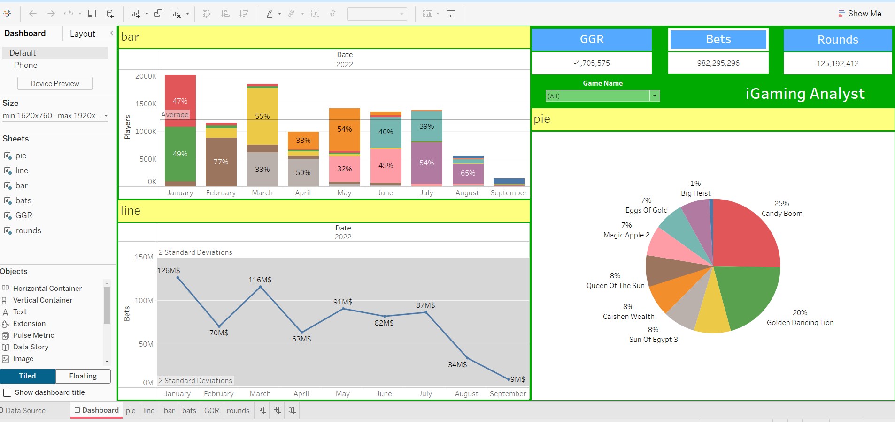

# 📊 iGaming Analyst Dashboard - Tableau Project

This Tableau dashboard is designed for analyzing key metrics in the iGaming industry. It provides insights into **player activity**, **bets**, **rounds**, and **game performance**, allowing iGaming analysts to monitor game performance, player engagement, and revenue.

---

## 📁 Project Overview

The dashboard includes the following components:

1. **Bar Chart**: Displays the total players for each month with category breakdowns, showing the distribution of players across different metrics.
2. **Line Chart**: Tracks the bets over time, showing fluctuations in player engagement and betting behavior.
3. **Pie Chart**: Breaks down the performance of various games, showing their share of the total bets.
4. **Key Metrics**: Displays important KPIs such as **GGR (Gross Gaming Revenue)**, **Bets**, and **Rounds** to help track overall game performance.

---

## 🔑 Key Features

### 1. **Bar Chart**
The bar chart provides a monthly view of player data:
- **Players**: Total number of players for each month in 2022.
- **Category Breakdown**: Shows the breakdown of player percentages across different categories for each month (e.g., Average, March, etc.).
- **Month-wise Data**: The data for January to September 2022, enabling the user to observe trends in player participation.

### 2. **Line Chart**
The line chart tracks the total bets over time:
- **Bets Data**: The chart visualizes total bets from January to September 2022, showing fluctuations and highlighting periods with the highest and lowest engagement.
- **Standard Deviations**: Displays 2 standard deviations to give context to the variations in bet amounts over time.

### 3. **Pie Chart**
The pie chart visualizes the performance of different games based on the total bets:
- **Top Games**: Shows the distribution of bets across different games. For example:
  - **Candy Boom**: 25% of total bets.
  - **Golden Dancing Lion**: 20% of total bets.
  - **Other games**: Smaller contributions like **Big Heist** (1%), **Eggs Of Gold** (7%), etc.
  
This helps identify the most popular games and their share of the total bets.

### 4. **Key Metrics**
- **GGR (Gross Gaming Revenue)**: A metric displaying the overall revenue for the period, showing how well the games are performing in terms of generating revenue.
- **Bets**: Total number of bets placed across all games.
- **Rounds**: The total number of rounds played, which is an indicator of engagement.
- **Game Filters**: Users can filter by specific game names to view data related to individual games' performance.

---

## 🧑‍💻 Technologies Used

- **Tableau**: For data visualization, dashboard creation, and data exploration.
- **Data Connection**: The data is connected from various sources (e.g., spreadsheets, databases) to Tableau for live updates and real-time analysis.
- **Calculated Fields**: Used to compute key metrics such as **GGR**, **bets**, and **rounds**.

---

## 🚀 Use Cases

- **Game Performance Analysis**: Track how individual games are performing in terms of player engagement and revenue generation.
- **Player Engagement**: Analyze monthly trends in player participation to optimize marketing and retention strategies.
- **Revenue Tracking**: Monitor **GGR**, **bets**, and **rounds** to ensure profitability and engagement across the platform.
- **Decision-Making**: Identify high-performing games to prioritize and areas of improvement for lower-performing games.

---

## 🧠 Future Enhancements

- **Real-Time Data Integration**: Implement real-time updates to track ongoing player activity and revenue generation.
- **Advanced Forecasting**: Use predictive analytics to forecast future bets, rounds, and game performance.
- **Interactive Filters**: Add more filters, such as game categories or player demographics, to enhance data exploration and drilldowns.

---

## 📷 Screenshot of Dashboard

> *Ensure the image is correctly linked in your repo directory.*

---

## 🧑‍💼 Author

- **[Abdulsalam Alizade]**  
Data Analyst | Tableau Specialist | iGaming Analyst

---

